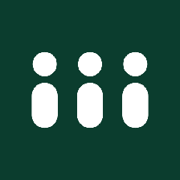
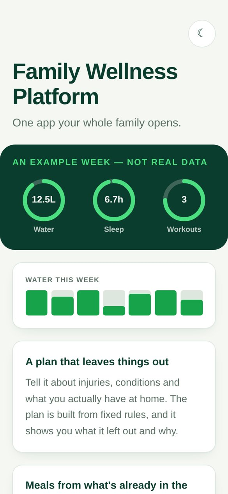
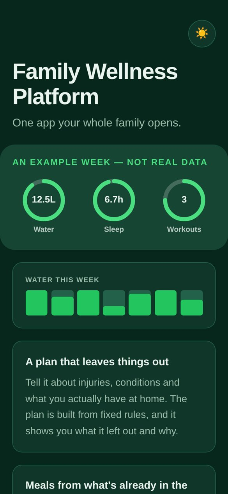
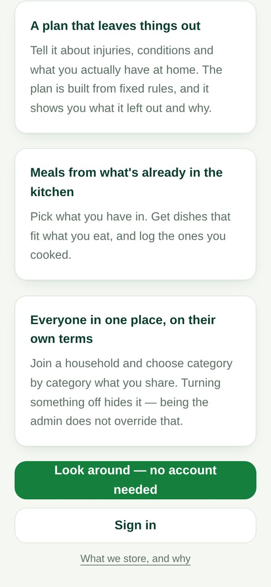
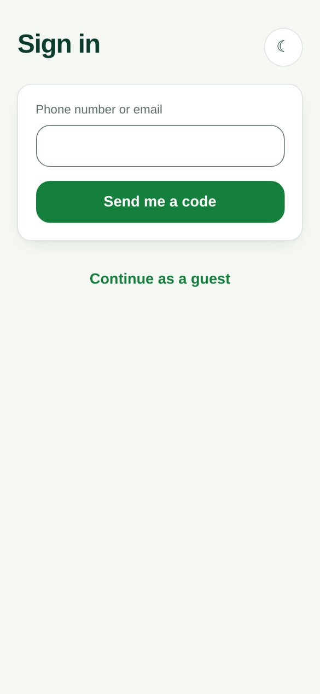

<div align="center">



# Family Wellness Platform

**One app your whole family opens.**

Workouts that leave out what isn't right for you, meals from what's already in the kitchen, and
water and sleep tracking. Everyone in the household uses the same app, and each person decides
what the others get to see.


[](LICENSE)
[](https://github.com/niyatinehal/kindling/actions/workflows/ci.yml)






</div>

## Features

- **A workout plan that leaves things out.** Tell it about injuries, medical conditions, where you
  train and what equipment you have. The plan is built from fixed rules, not a model, and it tells
  you what it left out and why.
- **Meals from what's in your kitchen.** Tick what you have in and get dishes that fit what you
  eat: vegetarian, Jain, vegan, no dairy and more. Log the ones you cooked.
- **Water, sleep and workouts**, with a weekly view of how you're doing.
- **One household, on everyone's own terms.** Start a family or join one with an invite code. Each
  person chooses category by category what the family admin can see, and turning something off
  hides it. Being the admin does not override that.
- **Roles for everyone in the house:** adults, children with guarded accounts, and a simplified,
  gentler track for older family members.
- **Try it without an account.** Look around as a guest, and add an email or phone number later to
  keep what you logged.
- Sign in with a one-time code, with no password to remember. Light and dark mode, and today's
  plan stays available when you're offline.

## Install

### Android

1. Download the latest `Wellness.apk` from **[Releases](../../releases)**.
2. Open it on your phone and allow installing from your browser or file manager when asked.
3. Open **Wellness**.

It isn't on the Play Store yet. The app opens the live site full-screen, so it needs Chrome (or
another browser that supports Trusted Web Activities) and an internet connection the first time.

### Web and iPhone

Open **[wellness-platform-sigma.vercel.app](https://wellness-platform-sigma.vercel.app)**. To
add it to your home screen, use **Install app** in Chrome, or **Share → Add to Home Screen** in
Safari.

## Getting started

1. Tap **Look around — no account needed**, or **Sign in** with your phone number or email.
2. Tell it a little about yourself: your goal, where you train, and any injuries or conditions.
   It takes about a minute, and sex, height and weight are optional.
3. Tap **Build my plan**, then **Plan a meal** to see what you can cook tonight.
4. To bring in the rest of the house, go to **Family → Start a family** and share the invite code.
   Each code works once and expires after 7 days.

> [!NOTE]
> This isn't medical advice. The plan leaves out exercises that aren't right for what you told it,
> but if anything hurts, stop, and check with your doctor if you're unsure.

## Privacy

- No analytics, no ads, no third-party tracking scripts.
- The workout plan and meal suggestions are built by fixed rules in the app, not a machine-learning
  model. Nothing about your health, account or family is sent to an outside service.
- One optional feature sends things out, and it is off unless you turn it on: with **smarter
  reading** on the meals screen, what you type about your kitchen, or a photo of your fridge or a
  receipt, is sent to an AI model (Anthropic's Claude or Google's Gemini) to be read into a list of ingredients, and it writes a
  line about why each suggested dish fits. Nothing from your profile is sent, photos are never
  stored, and child accounts and anyone who may be under 18 can't turn it on.
- A family admin sees only the categories you chose to share.
- You can delete your account from the home screen, and everything you logged goes with it,
  straight away.

The full policy, including where the data is stored and who hosts it, is on the in-app
**[What we store, and why](https://wellness-platform-sigma.vercel.app/privacy)** page.

## Building

The web app is Next.js, the API is Express with Prisma, and both use Supabase for Postgres and
sign-in. Running it locally, deploying it and running the tests are all covered in
**[docs/DEVELOPMENT.md](docs/DEVELOPMENT.md)**.

<details>
<summary>Building the Android app</summary>

The APK is a [Bubblewrap](https://github.com/GoogleChromeLabs/bubblewrap) Trusted Web Activity
generated from `android/twa-manifest.json`. You need Java 17 and the signing keystore, which is
never committed.

```bash
cd android
bubblewrap update --skipVersionUpgrade
bubblewrap build
```

`web/public/.well-known/assetlinks.json` has to list the SHA-256 fingerprint of the key the APK is
signed with. If it doesn't, the app still opens, but as a browser tab with the address bar
showing.

</details>

## License

[MIT](LICENSE). The code is free to use, change and share. The name, the hosted app and its
users' data are not part of it: a fork runs its own database and signs its own APK.
